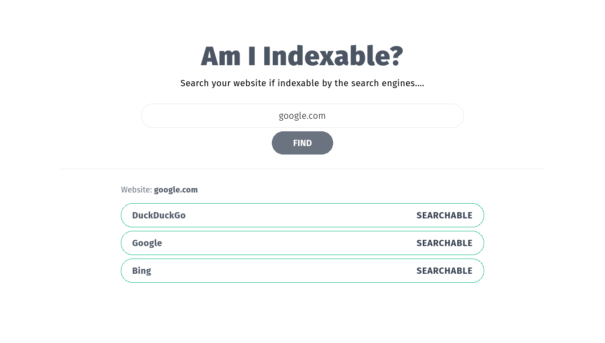

# Am I Indexable ?

Simple mini-project to check if website is indexed or searchable in `web search engines`.

### Screenshot

## Development

Use the `vercel` CLI

    $ vercel dev

- Tailwind CSS

  - development css

        $ yarn dev-css

  - production css

        $ yarn build-css

- Run Only Svelte

        $ yarn dev

### Folder Structure

- **`api`** - backend api (python, `fastapi`)
- **`public`, `scripts`, `src`** - frontend (`SVELTE`)

### &copy; TheBoringDude | 2021
